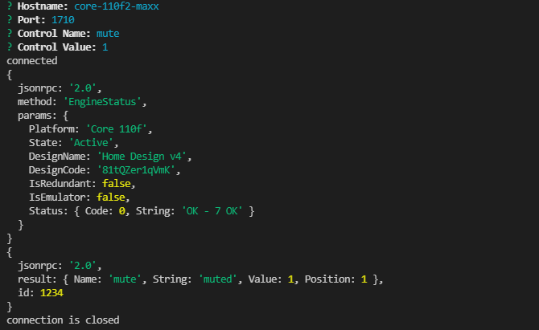

# QSYS Node Core Control
Simple script to send commands to a Q-Sys Core with Node JS via ECP or QRC

## Description 
 This is a simple script that uses Node JS to send single commands to a Q-SYS Core via the command line. It allows the user to send commands via ECP (port 1702) or QRC (port 1710).

## Table of Contents 
* [Technologies](#Technologies)
* [Usage](#Usage)
* [License](#License)
* [Badges](#Badges)
* [Tests](#Tests)
* [Questions](#Questions)

## Technologies 
* Written in Javascript and uses node.js to run.
* This application uses the inquirer npm package.
* It also uses net for sending and receiving TCP data.
* It communicates with a Q-SYS Core via the ECP (port 1702) and QRC (port 1710) protocols.

## Usage 
Open a terminal and run the application using the 'node index.js' command. It will ask for the hostname of the Core as well as the port. If port 1702 (ECP) is selected, it will ask you specify which command type (csv, css, or csp). It will then ask for the named control and value. It will send the command, print the response, and close the connection. If port 1710 (QRC) is selected, it will bypass the command type requirement. 

## License 
 MIT

## Badges 
 
 

## Tests 
 No tests are currently in place for this project.

## Questions 
 For any questions, contact me at [maxxsanner105@gmail.com](mailto:maxxsanner105@gmail.com).
#### 
